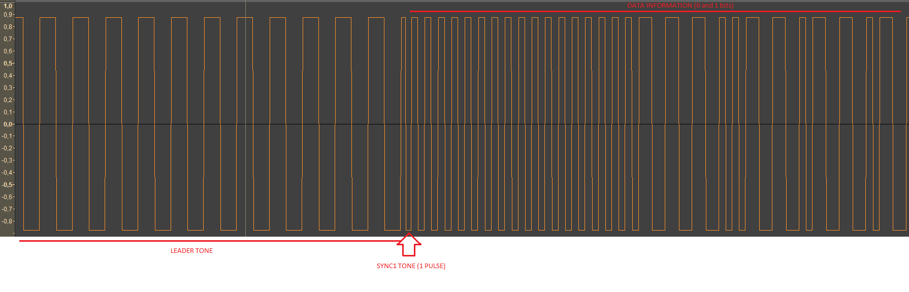

# POWADCR
TAP/TZX Digital cassette recorder for 8-bit machines
-----
This project pretend to implement a Digital Cassette Recorder (for TAP/TZX/SNA files playing and recording) for 8-bit machines on ESP32 Audio kit development board.

The launcher was this board below, ESP32 Audio Kit equipped with ESP32 microcontroller and ES8388 Audio proccesor 
made by AI-Thinker Technology.

https://docs.ai-thinker.com/en/esp32-audio-kit

The summary of specifications is.
+ CPU 32 bits at 240MHz
+ 512KB + 4MB SRAM
+ 2 CORES
+ ES8388 dedicated audio proccesor
+ Audio IN/OUT
+ Bluetooth
+ WiFi
+ 8 switch buttons
+ I/O connectors
+ SD slot
+ ...

So, it's a beautiful develop board with a big possibilities. 

To begin with is necessary use the Phil Schatzmann's libraries for ESP32 Audio Kit (https://github.com/pschatzmann/arduino-audiokit) where we could take advantage of all resources of this kit, to create a digital player and recorder for ZX Spectrum easilly, or this is the first idea.

This project need set PCB switches to

|Switch|Value|
|---|---|
|1|On|
|2|On|
|3|On|
|4|Off|
|5|Off|

## Set Arduino IDE

Set board how "ESP32 DEV".

Required libraries:
- SdFat (https://github.com/greiman/SdFat)
- arduino-audiokit (https://github.com/pschatzmann/arduino-audiokit/tree/main)
- Audiotools (??)

## About Sinclair ZX Spectrum TAP structure.

-----

About loading proccess in Sinclair ZX Spectrum
-----
I recomend the Alessandro Grussu's website with an interesting information about the loading process and processor timming for this goal. https://www.alessandrogrussu.it/tapir/tzxform120.html#MACHINFO

Now, I'd like to show you how the signal generated from TAP file that Sinclair ZX Spectrum is able to understand. The mechanism to read the audio signal is based on squarewave peaks counting, using the Z80 clock timming, then:

The sequence for ZS Spectrum, is always: 
+ LEADER TONE + SYNC1 + DATA TONES + SYNC2 + SILENT

 Where: LEADER TONE (2168 T-States) is two kind of length. 
+ Large (x 8063 T-States) for typical "PROGRAM" block (BASIC)
+ Short (x 3223 T-States) for typical "BYTE" block, Z80 machine code. 

**What means T-State?**

Well, this concept could be difficult to understando, but it's not far of reallity, as summarized full pulse (two peaks one to high and one to low) has a period equal to 2 x T-State time, where T-State = 1/3.5MHz = 0.28571 us, then for example: LARGE LEADER TONE.
+ LEADER TONE = 2168 x 8063 T-States = 17480584 T-States
+ 1 T-State = 1 / 3.5MHz = 0.28571 us = 0.00000028571 s
+ LEADER TONE duration = 17480584 x 0.00000028571 s = 4.98s

**How many peaks has the LARGE LEADER TONE pulse train?**
+ The pulse train has 2168 peaks in both cases but short leader tone has a different duration (3223 T-States) versus large leader tone (8063 T-States)

**What's the signal frequency?**
+ We know that LARGE LEADER TONE pulse train is 4.98s 
+ We know that SHORT LEADER TONE pulse train is 1.99s
+ The frecuency for both leader tones (2168 x 0.00000028571) / 2 = 809.2Hz

