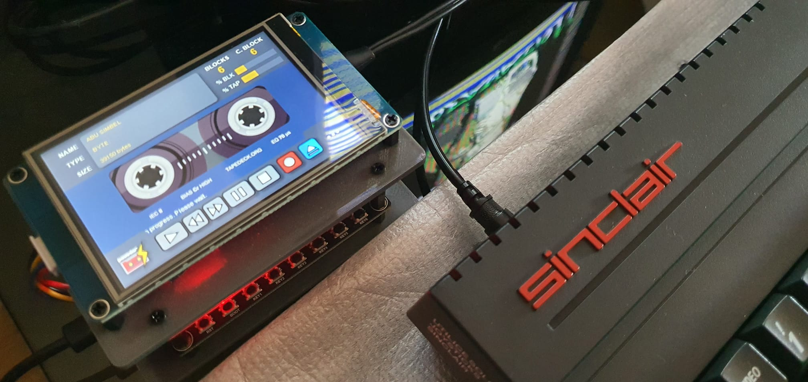

# POWADCR
TAP/TZX Digital cassette recorder for 8-bit machines
-----

This project pretend to implement a Digital Cassette Recorder (for TAP/TZX/SNA files playing and recording) for ZX Spectrum machines on ESP32 Audio kit development board and using HMI over touch 3.5" screen.

The launcher was this board below, ESP32 Audio Kit equipped with ESP32 v3 microcontroller and ES8388 Audio proccesor 
made by AI-Thinker Technology.

https://docs.ai-thinker.com/en/esp32-audio-kit

The summary of specifications is.
+ CPU 32 bits at 240MHz
+ 512KB + 4MB SRAM
+ 2 CORES
+ ES8388 dedicated audio proccesor
+ Audio IN/OUT
+ Bluetooth
+ WiFi
+ 8 switch buttons
+ I/O connectors
+ SD slot
+ ...

So, it's a beautiful develop board with a big possibilities. 

To begin with is necessary use the Phil Schatzmann's libraries for ESP32 Audio Kit v.0.65 (https://github.com/pschatzmann/arduino-audiokit) where we could take advantage of all resources of this kit, to create a digital player and recorder for ZX Spectrum easilly, or this is the first idea.

This project need set PCB switches to

|Switch|Value|
|---|---|
|1|On|
|2|On|
|3|On|
|4|Off|
|5|Off|

## LCD Screen Display

The LCD touch screen display chosen for this project is a TFT HMI LCD Display Module Screen Touch connected with 2 serial pins (TX and RX) to the board. 
+ Brand: TJC
+ Model: TJC4832T035_011
+ Size: 3.5".
+ Resolution:  480x320.

## About Sinclair ZX Spectrum TAP structure.

-----

About loading proccess in Sinclair ZX Spectrum
-----
I recomend the Alessandro Grussu's website with an interesting information about the loading process and processor timming for this goal. https://www.alessandrogrussu.it/tapir/tzxform120.html#MACHINFO

Now, I'd like to show you how the signal generated from TAP file that Sinclair ZX Spectrum is able to understand. The mechanism to read the audio signal is based on squarewave peaks counting, using the Z80 clock timming, then:

The sequence for ZS Spectrum, is always: 
+ LEADER TONE + SYNC1 + DATA TONES + SYNC2 + SILENT

 Where: LEADER TONE (2168 T-States) is two kind of length. 
+ Large (x 8063 T-States) for typical "PROGRAM" block (BASIC)
+ Short (x 3223 T-States) for typical "BYTE" block, Z80 machine code. 

**What means T-State?**

Well, this concept could be difficult to understand, but it's not far of reallity, as summarized full pulse (two peaks one to high and one to low) has a period equal to 2 x T-State time, where T-State = 1/3.5MHz = 0.28571 us, then for example: LARGE LEADER TONE.
+ LEADER TONE = 2168 x 8063 T-States = 17480584 T-States
+ 1 T-State = 1 / 3.5MHz = 0.28571 us = 0.00000028571 s
+ LEADER TONE duration = 17480584 x 0.00000028571 s = 4.98s

**How many peaks has the LARGE LEADER TONE pulse train?**
+ The pulse train has 2168 peaks in both cases but short leader tone has a different duration (3223 T-States) versus large leader tone (8063 T-States)

**What's the signal frequency?**
+ We know that LARGE LEADER TONE pulse train is 4.98s 
+ We know that SHORT LEADER TONE pulse train is 1.99s
+ The frecuency for both leader tones (2168 x 0.00000028571) / 2 = 809.2Hz

About POWADCR Device.
-----
In this section we are going to describe parts to be needed to assemble the PowaDCR device.

**Bill of material**
+ Main board: ESP32 Audiokit by AI-Thinker technology : https://docs.ai-thinker.com/en/esp32-audio-kit (Possible buy site. Alliexpress)
+ Color LCD 3.5" 480x320 pixels. Resistive TouchScreen - TJC4832T035_011 resistive (low priced but possible to discontinued and replaced by TJC4832T135 _ 011C capacitive or TJC4832T135 _ 011R resistive)
+ Cable XH2.5 to dupont to connecto LCD to the extended port of ESP32 Audiokit
+ Battery 2000mAh 3.7v (optional not needed)
+ Micro SD card FAT32 formatted (to contain all ZX Spectrum games in TAP and other formats to be red for PowaDCR in the future)
+ Micro SD card or FT232RL FTDI serial interface to program the TJC LCD (both methods are available)
+ Cable with jacks Stereo-stereo male-male 3.5mm to connect PowaDCR to Spectrum Next or N-Go or clone versions.
+ Cable with XH2.5 and mono jack 3.5mm to connect from amplifier out of PowaDCR to EAR connector on ZX Spectrum classic versions (Rubber keyboard 16K, 48K, Spectrum+ and Spectrum 128K Toastrack)
+ HMI Chinesse editor version https://unofficialnextion.com/t/tjc-usart-hmi-editor-1-64-1/1511
+ Arduino IDE 2.0

Hacking the Audiokit board.
-----
This board is build from the same design from AC101 audio chip version, but with ES8388 chip. In this case both mic and line-in are mixed. Not possible to select by independ way mic or line-in then the environment noise come in when the ZX Spectrum signal is capturing.
So, it shall be removed both integrated microphones.

How PowaDCR parts are connected?
-----
(in progress)

From my compiled .bin
-----
1. Download ESP32 Flash Downloading Tool -
2. Select
   - ESP32
   - Develop
     And press "OK" button
     
     Show image below.
     
     

   
4. Select
   - Select .bin file or write the path of it (see below lastest stable version)
   - Select all parameters exactly at the image below.
   - Connect ESP32-A1S Audiokit board from UART microUSB port (not power microUSB PORT) at PC USB port.
   - Select the available COM for this connection in COM: field on ESP32 Flash Downloading Tool.
   - Select BAUD: speed at 921600
   - Disconnect the Touch Screen cable in order to release serial port (Audiokit sharing USB and UART communications)
   - Press START button in ESP32 Flash Downloading Tool. Then downloading proccess begin, and wait for FINISH message. Enjoy!
  
     NOTES: If the proccess fail.
      - Try to download again.
      - Try to ERASE before START proccess.

     lastest version: <a href="https://github.com/hash6iron/powadcr_IO/blob/main/powaDCR-ESP32-A1S-v0.3.15.bin">powaDCR-ESP32A1S-v0.3.15.bin</a>
   
   Show image below.
   

How firmware is loaded in ESP32 Audiokit? (For custom firmware)
-----
1. Install Arduino IDE 2.0
2. Apply this BOARD repository to Arduino IDE preferences.
   - https://raw.githubusercontent.com/espressif/arduino-esp32/gh-pages/package_esp32_index.json

3. Connect the ESP32 Audiokit USART USB port to any USB PC port
4. Set board as "ESP32 DEV MOD" and select correct COM port

Required libraries:
- SdFat (https://github.com/greiman/SdFat)
- arduino-audiokit (https://github.com/pschatzmann/arduino-audiokit/tree/main)

How firmware is loaded in TJC LCD?
-----
(in progress)

What PowaDCR beta version is able to do?
-----
(in progress)

If you enjoy with this device and you want to colaborate, please.

thxs.
